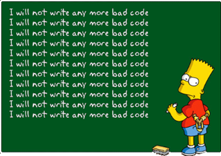
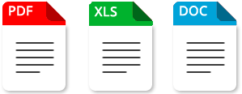

# Mini applications

## 📚 Use Case Library

Greetings [@everyone](#-use-case-library)🖖

This week, while I was working on some projects that involve a high stack of technologies, I noticed that I was clinging to a specific framework. This isn't a problem for me, particularly as I love Laravel and Composer. They are among the most complete tools I've ever found and are often the frameworks that others aspire to be.

However, some projects may not include all the necessary components. Using a robust MVC framework may not always be the obvious choice for companies with more agnostic foundations. This realization reminded me of an essential principle, which I am sharing here as a diary entry:

#### [**Don't repeat yourself**](https://en.wikipedia.org/wiki/Don%27t_repeat_yourself)

A.k.a. by the acronym "**DRY**", is a computer programming concept that proposes that each piece of knowledge in a system must have a representation unique, authoritative and free from ambiguity throughout the system. This expression was coined by **Andy Hunt** and **Dave Thomas** in *[their book](https://www.google.com.br/books/edition/The_Pragmatic_Programmer/5wBQEp6ruIAC)*.

Don't expect anything fancy, we'll keep it simple. Back to roots, to dev school with simple OOP lessons. [Why?](https://www.reddit.com/r/quotes/comments/oya2sd/an_idiot_admires_complexity_a_genius_admires/)

- The main idea: [10 Must-do small PHP projects to include in portfolio](https://www.youtube.com/watch?v=ZEkSfymY6mk).

### 📄 Data import/export with  PDF, XLS, DOC, CSV

Generate some basic information by creating new files. Read information by parsing the document, organizing it, etc. Examples: Resume Dynamic Generator, RPG Character Profile Dynamic Generator.

- Create reusable functions for file parsing and generation.
- Use a single source of truth for file format specifications.

### 🛒 Shopping Cart (done)

For this one, probably the simplest way to demonstrate is saving products to a cookie locally, then merging to the DB. Certainly, customers will have products in both.

### 📝 Simple CRUD Applications

Create, Read, Update, Delete. Adding pagination, sorting, and filtering in all fields.

### 🌐 Use CURL API

Send or receive information to third-party applications. This project may become more interesting when combined with the PDF/Excel use case (when done).

### 🛡️ Customer Registration

A basic and essential part of your own library. Start simple, come back later, make it bigger. The more complex, the better.

**Examples**: Shipping and delivery address, credit card information, password fields, data security methods.

### 📧 Email Sending

How to format properly like Body, Subject, CC, BCC, attach files, etc.

*Image: [Vikrant Badhani - Quora](https://www.quora.com/How-does-the-sending-of-email-work)*

### 📅 Event Manager

The goal behind this one is to work with datetimes with different UTC timezones. Maybe a good start can have a calendar, adding some properties, some different use cases for each timezone, or different building overloading methods.

---

Whether you are an astronaut, a time traveler, a friend, or a stranger, you are reading this in the future, so it is likely that all or almost all of these use case examples are already implemented below. Feel free to browse and read some of my code. This is all the context this repository needs.

